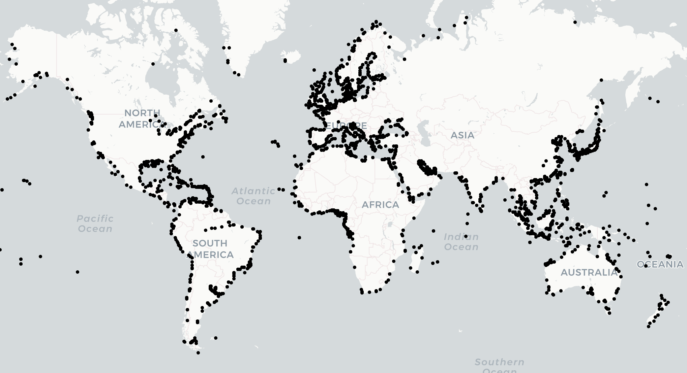

# Worldwide Ports Dataset

This repository contains a JSON dataset of 3,899 worldwide ports, including their latitude and longitude. The list was generated using **Pub 150**, various networking tools, and OpenAI's API. 



## Dataset Structure

The dataset provides the following details for each port:

- **CITY**: The city where the port is located.
- **STATE**: The state or region.
- **COUNTRY**: The country where the port is situated.
- **LATITUDE**: The latitude of the port.
- **LONGITUDE**: The longitude of the port.

### Example JSON Entries
```json
[
    {"CITY":"Aabenraa","STATE":"South Denmark","COUNTRY":"Denmark","LATITUDE":55.04,"LONGITUDE":9.42},
    {"CITY":"Laâyoune","STATE":"Western Sahara","COUNTRY":"Morocco","LATITUDE":27.07,"LONGITUDE":-13.47},
    {"CITY":"Aalborg","STATE":"North Jutland","COUNTRY":"Denmark","LATITUDE":57.05,"LONGITUDE":9.92},
]
```

## Use Cases

This dataset can be utilized in various domains, for example:

- **Grounded Truth**: For model creation.
- **Prompt fine-tuning**: For fine tuning models.
- **Routing**: Developing maritime and logistic routes.
- **ETA Predictions**: For use with time of arrival calculations.

## Contribution

We welcome contributions and suggestions to improve the dataset. Feel free to:

- Submit issues or enhancements via the [GitHub Issues page](#).
- Fork the repository and submit pull requests with updates or new data.

## Additional Resources

For a detailed explanation of how this dataset was created and potential use cases, check out our [Medium article](https://placeholder-link.com).

## Contact

If you have any questions or would like to contribute, please reach out via [LinkedIn](https://www.linkedin.com/in/tayljordan/).
