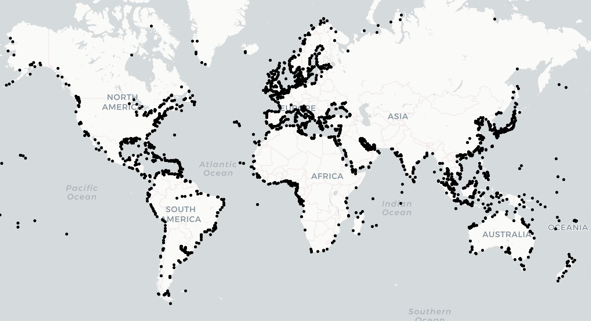

# Worldwide Maritime Ports Dataset

This repository contains a JSON dataset of **5,410 worldwide maritime ports and points of interest (POIs)** sourced in part from **National Geospatial-Intelligence Agency Publication 150 (World Port Index, 2019 edition)**. Fields include location, depth soundings, tidal range, entrance restrictions, vessel size, and more.

> **Disclaimer:** Port particulars are not comprehensive and may change without notice. Depth values represent a single recorded sounding and do not account for multiple berths, shifting bottom conditions, silting, dredging, seasonal variation, or other factors that may alter actual depths. Tidal range, vessel size limits, and entrance restrictions reflect conditions at time of publication and may no longer be accurate. This dataset does not substitute for current nautical charts, Notices to Mariners, or official port authority guidance. Data may be in error. Use at your own risk.



## Dataset Structure

The file `data/ports.json` is a wrapped JSON object with a `metadata` block and a `ports` array.

### Metadata Fields

| Field | Description |
|---|---|
| `schema_version` | Dataset schema version |
| `record_count` | Total number of maritime port records |
| `last_updated` | Date last modified |
| `source` | Primary data source |
| `coordinate_datum` | World Geodetic System 1984 (WGS84) |
| `depth_unit` | meters |
| `coverage` | Breakdown of enriched vs location-only records |
| `attribution` | Author and contact |
| `disclaimer` | Data use disclaimer |

### Maritime Port Record Fields

| Field | Type | Description |
|---|---|---|
| `wpi_port_id` | integer / null | Unique World Port Index port number (National Geospatial-Intelligence Agency Publication 150) |
| `wpi_port_name` | string / null | Port name as listed in World Port Index |
| `point_of_interest` | string / null | City, facility, or place name |
| `state` | string / null | State or region |
| `country` | string / null | Country |
| `latitude` | float | World Geodetic System 1984 (WGS84) latitude, rounded to 2 decimal places |
| `longitude` | float | World Geodetic System 1984 (WGS84) longitude, rounded to 2 decimal places |
| `port_size` | string / null | Major, Minor, Small, or Very Small |
| `channel_depth_min_m` | float / null | Minimum controlling channel depth (m) |
| `channel_depth_max_m` | float / null | Maximum controlling channel depth (m) |
| `anchorage_depth_min_m` | float / null | Minimum anchorage depth (m) |
| `anchorage_depth_max_m` | float / null | Maximum anchorage depth (m) |
| `cargo_pier_depth_min_m` | float / null | Minimum cargo pier depth (m) |
| `cargo_pier_depth_max_m` | float / null | Maximum cargo pier depth (m) |
| `oil_terminal_depth_min_m` | float / null | Minimum oil terminal depth (m) |
| `oil_terminal_depth_max_m` | float / null | Maximum oil terminal depth (m) |
| `mean_tidal_range_m` | float / null | Mean tidal range (m) |
| `entrance_restriction_tide` | bool / null | Tide restricts entrance |
| `entrance_restriction_heavy_swell` | bool / null | Heavy swell restricts entrance |
| `entrance_restriction_ice` | bool / null | Ice restricts entrance |
| `entrance_restriction_other` | bool / null | Other natural factors restrict entrance |
| `max_vessel_size` | string / null | Maximum vessel size accommodated |

### Example JSON Entry

```json
{
  "wpi_port_id": 100,
  "wpi_port_name": "REYKJAVIK",
  "point_of_interest": "Reykjavik",
  "state": null,
  "country": "Iceland",
  "latitude": 64.15,
  "longitude": -21.93,
  "port_size": "Minor",
  "channel_depth_min_m": 38.4,
  "channel_depth_max_m": 42.1,
  "anchorage_depth_min_m": 23.8,
  "anchorage_depth_max_m": 27.4,
  "mean_tidal_range_m": 4.0,
  "entrance_restriction_tide": true,
  "entrance_restriction_heavy_swell": false,
  "entrance_restriction_ice": false,
  "entrance_restriction_other": true,
  "max_vessel_size": "large vessels"
}
```

## Example Usage

### Find a maritime port by point of interest

```python
import json

def find_port(file_path, name):
    with open(file_path, 'r', encoding='utf-8') as f:
        data = json.load(f)
    for port in data['ports']:
        if port.get('point_of_interest') == name:
            return port
    return None

result = find_port('data/ports.json', 'Reykjavik')
print(result)
```

### Find all maritime ports within a channel depth range

```python
import json

def find_ports_by_channel_depth(file_path, min_m, max_m):
    with open(file_path, 'r', encoding='utf-8') as f:
        data = json.load(f)
    return [
        p for p in data['ports']
        if p.get('channel_depth_min_m') is not None
        and min_m <= p['channel_depth_min_m'] <= max_m
    ]

deep_ports = find_ports_by_channel_depth('data/ports.json', 20.0, 50.0)
print(f"{len(deep_ports)} maritime ports found")
```

## Use Cases

- **Grounded Truth**: For model training and validation.
- **Routing**: Developing maritime and logistic routes.
- **ETA Predictions**: Time of arrival calculations.
- **Depth Analysis**: Vessel draft and channel suitability screening.
- **Tidal Planning**: Operations dependent on tidal windows.

## Data Sources

- **National Geospatial-Intelligence Agency Publication 150** — World Port Index, 2019 edition. Depths are in meters at chart datum.
- Points of interest list compiled using various networking tools.

## Contribution

Contributions and corrections are welcome:

- Submit issues or enhancements via the [GitHub Issues page](https://github.com/tayljordan/ports/issues).
- Fork the repository and submit pull requests with updates or new data.

## License

MIT License — Copyright (c) 2026 Jordan Taylor. See [LICENSE](LICENSE) for full terms.

## Contact

Questions or contributions — reach out via [LinkedIn](https://www.linkedin.com/in/tayljordan/).
